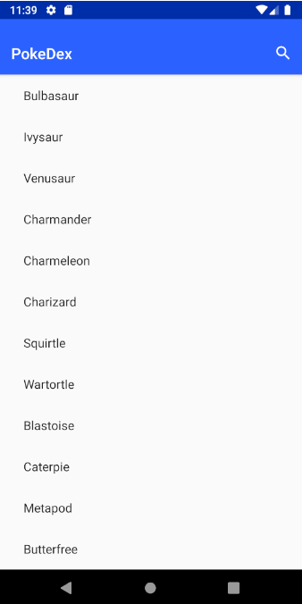
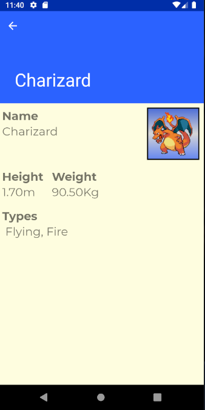

```java
    ____        __            __         
   / __ \____  / /_____  ____/ /__  _  __
  / /_/ / __ \/ //_/ _ \/ __  / _ \| |/_/
 / ____/ /_/ / ,< /  __/ /_/ /  __/>  <  
/_/    \____/_/|_|\___/\__,_/\___/_/|_|  

 __               __   __   __   ___     __                  ___           
|__) \ /       | /  \ |__) / _` |__     /  `  /\  |    |    |__     |  /\  
|__)  |     \__/ \__/ |  \ \__> |___    \__, /~~\ |___ |___ |___ \__/ /~~\ 

```


# PokeDex
----------
A simple "Pokedex" consuming api in https://pokeapi.co (by implementing pokekotlin 2.3.0 wrapper) and using:

- Kotlin<br>
- CleanCoede<br>
- MVP <br>
- Kotlin<br>
- Fragments<br>
- ConstraintLayout<br>
- RecycerView <br>
- CoordinatorLayout<br>
- Coroutines <br>
- Unit tests <br>
- SearchBar <br>

And:
- Glide (Loading Images in background) <br>
- Lottie (Show vector animations)<br>

### Screenshots:
 


